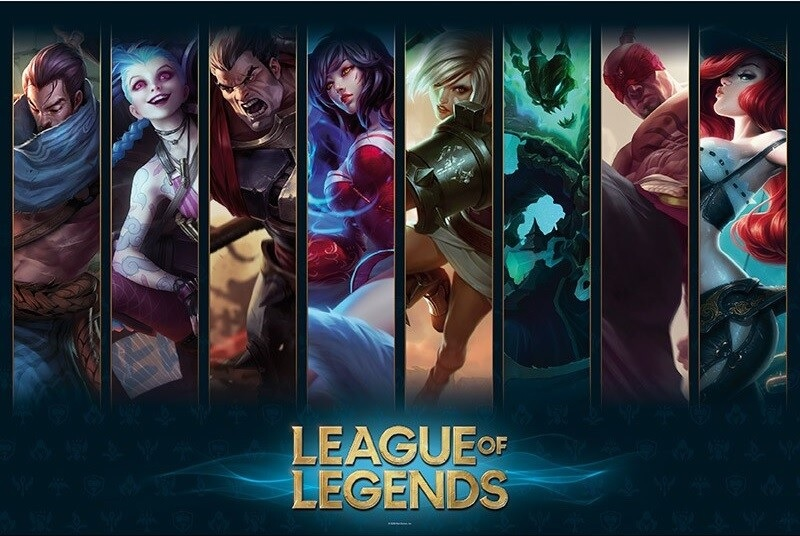

# Project: LOL

Note: I submitted this project too to see how many points it'd get

  

### 1 Dataset

In this section, the League of Legends dataset selected for this work is described. To better understand the content of the dataset, a brief introduction to how League of Legends works is provided. Finally, the structure of this dataset is explained.

### 1.1 Introduction

[League of Legends](https://www.leagueoflegends.com/es-es/) is a multiplayer online battle arena ([MOBA](https://en.wikipedia.org/wiki/Multiplayer_online_battle_arena)) video game developed by Riot Games. League of Legends is one of the most popular online games. In 2020 alone, League of Legends had over 110 million active players, which shows that even though the game is over 10 years old, it is still quite popular; it also shows that new players are creating accounts and joining.

In this game, there are two teams, Red and Blue, each consisting of 5 players. The goal of each team is to destroy the other team's base of operations (Nexus). The team that does so first wins the game. League of Legends matches can be quite long since as long as both teams' bases remain standing, the game continues. The average game length according to Riot Games is around [30 minutes](https://www.leagueofgraphs.com/stats/game-durations).

Before the game starts, each player in the game must choose a unique champion. As of November 2, 2022, there are [162 champions](https://leagueoflegends.fandom.com/wiki/Champion) in the game to choose from, but that number increases frequently as Riot constantly introduces new champions to the game. The game gets complex quickly as beyond the 10 champions that are in the game (5 on your team and 5 on the other), there are many systems to take into account, such as the economic system for purchasing items, the experience system to allow your champion access to more powerful abilities, and neutral objectives that grant powerful effects.

### 1.1.1 Ranked Games

League of Legends still uses a form of ranking system inspired by the Elo system called the League system, matching players with similar skill levels to play with and against each other. It consists of **nine tiers** that indicate the **skill level of the players**. Players within each division are ranked using a points system called League Points (LP). Every time you play, you will lose or gain LP depending on whether you win or lose the game; the more LP you gain, the higher your Elo ranking can rise.

Below is a representation of all the tiers currently in League of Legends, starting from **Iron** (the lowest) on the left, followed by Bronze, **Silver**, **Gold**, **Platinum**, **Diamond**, **Master**, **Grandmaster**, and finally **Challenger** (the highest).

To see the full ranking distribution, you can visit the [rank distribution](https://www.leagueofgraphs.com/rankings/rank-distribution) link. It is considered that Diamond players are in the top 2.4% of players, meaning their understanding of the game is deep, and they generally make high-impact decisions that tend to pay off. Therefore, tracking their behavior and seeing what leads to victories in their games is an accurate way to predict who will win a game of League of Legends.

### 1.1.2 Glossary

- **Solo Queue**. The [**Solo Queue**](https://bloygo.yoigo.com/glosario/definicion-soloq/) or **SoloQ** is a game mode where gamers can **improve their skills by playing solo**. In this way, the SoloQ Challenge is a way to exploit a style of play that would otherwise remain in the shadows. It is typical of **League of Legends** because it is a sort of **purgatory where the player practices alone** in order to improve their skills.

- **Elo**. [**Elo**](https://leagueoflegends.fandom.com/wiki/Elo_rating_system#:~:text=A%20person%20with%20a%20higher,in%20relation%20to%20other%20players.) is essentially the ranking of a player. It is determined by the win/loss ratio and how many games a player has played. In a **normal Queue**, the Elo is hidden from the player and others, but the matchmaking system still uses it to decide the player's opponents. In ranked games, the player's Elo is visible to everyone, with **Iron being the lowest and Challenger the highest**.

- **Nexus**. The [**Nexus**](https://leagueoflegends.fandom.com/wiki/Nexus) is a structure that serves as the primary objective in all game modes in League of Legends. *The team that destroys the enemy's Nexus wins the match.*

- **Ward**. A Ward is a **guardian** in **LoL**. Wards allow you to see beyond the fog of war, which is crucial for, for example, **deciding when and if you should attack, and when is the best time to do so**. If the game is not going well, it’s best to place wards in our jungle, while if we are doing well, we can risk putting them in the enemy jungle to **see what our opponent is doing**.

- **Minion**. [**Minions**](https://leagueoflegends.fandom.com/wiki/Minion_(League_of_Legends)) are units that make up the main force sent by the Nexus. They are periodically generated from their Nexus and move along a lane toward the enemy Nexus, automatically engaging any enemy units or structures they encounter. They are controlled by artificial intelligence and only use basic attacks.

- **CS**. The minion death count is a recorded score, commonly known as [**Creep Score (CS)**](https://leagueoflegends.fandom.com/wiki/Farming).

- **Buff**. A [**buff**](https://leagueoflegends.fandom.com/wiki/Buff) (benefit) is any status effect granted to a champion or minion that provides a boost to their performance. The opposite is called a **debuff**. Buffs can enhance almost any attribute of a character, such as health, mana, attack damage, and ability power, but in some cases, they may provide more than just statistical changes.

- **First Blood**. [**First Blood**](https://www.pinnacle.com/en/esports-hub/betting-articles/league-of-legends/betting-on-first-blood/sgajzgnuz8lgxujv) (FB) refers to a League of Legends (LoL) team that achieves the first player kill of an enemy during a game. Getting FB on an opponent is crucial due to the impact it has in the early stages of the game.

- **Champions**. [**Champions**](https://leagueoflegends.fandom.com/wiki/Champion) are the characters controlled by the player in League of Legends. Each champion has unique abilities and attributes.

- **Turrets**. [**Turrets**](https://leagueoflegends.fandom.com/wiki/Turret) (also called towers) are strong fortifications that attack enemy units in sight. Turrets are a central component of League of Legends. They deal damage to enemies and provide vision to their team, allowing them to better control the battlefield. Turrets target one unit at a time and deal significant damage. Teams must destroy enemy turrets to push their assault into enemy territory.
