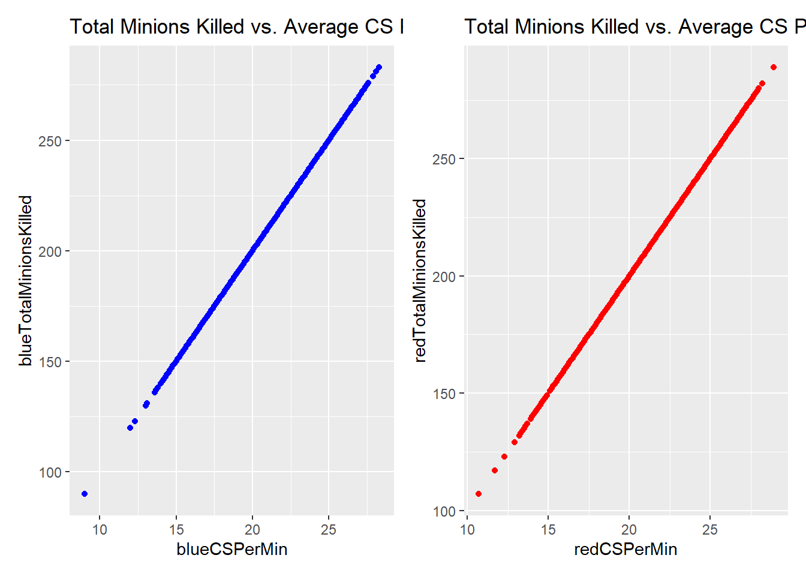

# Project: League of Legends Diamond Ranked Games (10 min)

<p align="center">
  
</p>


## Dataset

In this section, the League of Legends dataset selected for this work is described. To better understand the content of the dataset, a brief introduction to how League of Legends works is provided. Finally, the structure of this dataset is explained.

### Introduction

[League of Legends](https://www.leagueoflegends.com/es-es/) is a multiplayer online battle arena ([MOBA](https://en.wikipedia.org/wiki/Multiplayer_online_battle_arena)) video game developed by Riot Games. League of Legends is one of the most popular online games. In 2020 alone, League of Legends had over 110 million active players, which shows that even though the game is over 10 years old, it is still quite popular; it also shows that new players are creating accounts and joining.

In this game, there are two teams, Red and Blue, each consisting of 5 players. The goal of each team is to destroy the other team's base of operations (Nexus). The team that does so first wins the game. League of Legends matches can be quite long since as long as both teams' bases remain standing, the game continues. The average game length according to Riot Games is around [30 minutes](https://www.leagueofgraphs.com/stats/game-durations).

Before the game starts, each player in the game must choose a unique champion. As of November 2, 2022, there are [162 champions](https://leagueoflegends.fandom.com/wiki/Champion) in the game to choose from, but that number increases frequently as Riot constantly introduces new champions to the game. The game gets complex quickly as beyond the 10 champions that are in the game (5 on your team and 5 on the other), there are many systems to take into account, such as the economic system for purchasing items, the experience system to allow your champion access to more powerful abilities, and neutral objectives that grant powerful effects.

####  Ranked Games

League of Legends still uses a form of ranking system inspired by the Elo system called the League system, matching players with similar skill levels to play with and against each other. It consists of **nine tiers** that indicate the **skill level of the players**. Players within each division are ranked using a points system called League Points (LP). Every time you play, you will lose or gain LP depending on whether you win or lose the game; the more LP you gain, the higher your Elo ranking can rise.

Below is a representation of all the tiers currently in League of Legends, starting from **Iron** (the lowest) on the left, followed by Bronze, **Silver**, **Gold**, **Platinum**, **Diamond**, **Master**, **Grandmaster**, and finally **Challenger** (the highest).

To see the full ranking distribution, you can visit the [rank distribution](https://www.leagueofgraphs.com/rankings/rank-distribution) link. It is considered that Diamond players are in the top 2.4% of players, meaning their understanding of the game is deep, and they generally make high-impact decisions that tend to pay off. Therefore, tracking their behavior and seeing what leads to victories in their games is an accurate way to predict who will win a game of League of Legends.


#### Glossary

- **Solo Queue**. The [**Solo Queue**](https://bloygo.yoigo.com/glosario/definicion-soloq/) or **SoloQ** is a game mode where gamers can **improve their skills by playing solo**. In this way, the SoloQ Challenge is a way to exploit a style of play that would otherwise remain in the shadows. It is typical of **League of Legends** because it is a sort of **purgatory where the player practices alone** in order to improve their skills.

- **Elo**. [**Elo**](https://leagueoflegends.fandom.com/wiki/Elo_rating_system#:~:text=A%20person%20with%20a%20higher,in%20relation%20to%20other%20players.) is essentially the ranking of a player. It is determined by the win/loss ratio and how many games a player has played. In a **normal Queue**, the Elo is hidden from the player and others, but the matchmaking system still uses it to decide the player's opponents. In ranked games, the player's Elo is visible to everyone, with **Iron being the lowest and Challenger the highest**.

- **Nexus**. The [**Nexus**](https://leagueoflegends.fandom.com/wiki/Nexus) is a structure that serves as the primary objective in all game modes in League of Legends. *The team that destroys the enemy's Nexus wins the match.*

- **Ward**. A Ward is a **guardian** in **LoL**. Wards allow you to see beyond the fog of war, which is crucial for, for example, **deciding when and if you should attack, and when is the best time to do so**. If the game is not going well, it’s best to place wards in our jungle, while if we are doing well, we can risk putting them in the enemy jungle to **see what our opponent is doing**.

- **Minion**. [**Minions**](https://leagueoflegends.fandom.com/wiki/Minion_(League_of_Legends)) are units that make up the main force sent by the Nexus. They are periodically generated from their Nexus and move along a lane toward the enemy Nexus, automatically engaging any enemy units or structures they encounter. They are controlled by artificial intelligence and only use basic attacks.

- **CS**. The minion death count is a recorded score, commonly known as [**Creep Score (CS)**](https://leagueoflegends.fandom.com/wiki/Farming).

- **Buff**. A [**buff**](https://leagueoflegends.fandom.com/wiki/Buff) (benefit) is any status effect granted to a champion or minion that provides a boost to their performance. The opposite is called a **debuff**. Buffs can enhance almost any attribute of a character, such as health, mana, attack damage, and ability power, but in some cases, they may provide more than just statistical changes.

- **First Blood**. [**First Blood**](https://www.pinnacle.com/en/esports-hub/betting-articles/league-of-legends/betting-on-first-blood/sgajzgnuz8lgxujv) (FB) refers to a League of Legends (LoL) team that achieves the first player kill of an enemy during a game. Getting FB on an opponent is crucial due to the impact it has in the early stages of the game.

- **Champions**. [**Champions**](https://leagueoflegends.fandom.com/wiki/Champion) are the characters controlled by the player in League of Legends. Each champion has unique abilities and attributes.

- **Turrets**. [**Turrets**](https://leagueoflegends.fandom.com/wiki/Turret) (also called towers) are strong fortifications that attack enemy units in sight. Turrets are a central component of League of Legends. They deal damage to enemies and provide vision to their team, allowing them to better control the battlefield. Turrets target one unit at a time and deal significant damage. Teams must destroy enemy turrets to push their assault into enemy territory.


### Description

To do this work we have selected the dataset [diamond ranking game](https://www.kaggle.com/datasets/bobbyscience/league-of-legends-diamond-ranked-games-10-min) from Kaggle. This dataset contains the first 10 minutes, statistics of about 10k ranked games (in SOLO QUEUE mode) of a high ELO (from DIAMOND I to MASTER). The players are of approximately the same level.

Within this dataset there are two features of interest (gameId and blueWins) and we will explain them before.

The feature **gameId** represents a single game. The gameId field can be useful to get more attributes from the Riot API.

The feature **blueWins** is the target value (the value we are trying to predict). A value of 1 means that the blue team has won. 0 otherwise.

There are 19 traits per team (38 total) collected after 10 minutes in-game. This includes kills, deaths, gold, experience, level, etc. It's up to you to do some feature engineering to get more information. Variables belonging to the blue team are prefixed with **blue**, while variables for the red team are prefixed with **red**.

The following briefly describes these traits:

- **blueFirstBlood, redFirstBlood**. Represents which team made the first kill. The value 1 represents that a team made the first kill, and 0 otherwise.

- **blueKills, redKills**. Represents the kills made by each team. A direct metric of how good the team is.

- **blueDeath, redDeath**. These are inverted variables of the above.

- **blueAssits, redAssits**. Represents the attacks by players from each team, which did not lead to the final deal. In a way, these stats represent team collaboration.

- **blueAvgLevel, redAvgLevel** - These represent the average level of champions per team.

- **blueTotalExperience, redTotalExperience, blueTotalGold, redTotalGold** - These represent the experience and gold stats earned by each team.

- **blueDragons, blueHeralds, redDragons, redHeralds** - These represent how many dragons and heralds a team killed.

- **blueEliteMonsters, redEliteMonsters** - These represent the number of high priority neutral monsters a team killed.

- **blueTotalMinionsKilled, redTotalMinionsKilled** - These represent the number of monsters killed by a team.

- **blueTotalJungleMinionsKilled, redTotalJungleMinionsKilled** - These represent the number of monsters killed by a team. Represents the number of jungle monsters killed by a team.

- **blueWardsPlaced, blueWardsDestroyed, redWardsPlaced, redWardsDestroyed** - **Wards** are one of the deployable units for different benefits. So the number of placements or destructions represents an active or dominant game in the first 10 minutes.

- **blueTowersDestroyed, redTowersDestroyed** - Represents the number of opponent turrets destroyed by each team. Also a useful index of aggressive game development.

- **blueGoldDiff, redGoldDiff** - Represents the difference in the amount of gold between teams. These metrics are calculated by the differences in the total amount of gold of the teams.

- **blueExperienceDiff, redExperienceDiff** - Represents the difference in the amount of experience between teams. These metrics are calculated by the differences in the total amount of experience of the teams.

- **blueCSPerMin, redCSPerMin**. Represents the number of minion kills (CS) per minute for a team.

- **blueGoldPerMin, redGoldPerMin**. Represents the amount of gold earned per minute for a team.

Within these characteristics there are some that are the result of additions, comparisons or additions of other variables. These variables can represent redundant information that must be taken into consideration.

In the case of aggregate variables, these are those that result from a calculation, such as an average. These variables can be identified by having the suffix **PerMin** or containing **Avg** in their names.

Other variables are of a comparative type that are the result of the difference between the totals (of something) of the teams. These types of variables are identified by having the suffix **Diff** in their name.

Finally, in the group of additive variables we only have the elite monster counts that are the sum of dragons and heralds.


The file containing the dataset is stored in [high_diamond_ranked_10min.csv](data/raw/high_diamond_ranked_10min.csv).


## Data Wrangling
In this section we are going to carry out the data manipulation or wrangling process (known as data wrangling) to make it more concise and better structured. Data wrangling is nothing more than the action of cleaning, unifying, consolidating and normalizing data so that it can be used and extract valuable information for its real use. Data wrangling is important because, if done correctly, it will improve the results and training speed of our ML algorithms later on. Part of this process is to eliminate unnecessary columns.

All data cleaning actions will be saved in the variable data.clean.

### Simple Variables

The only column that we seem to be able to remove right away is the gameId column. This column corresponds to the League of Legends API reference for the game. Using this number, we could request more information from the API. Since we will only be working with the data in the dataset, we can remove this column since it does not affect whether a game is won or not.

However, we are going to use the gameId attribute as the row name since it is unique and can make error analysis easier for us later.

### Aggregative variables

Our dataset is composed of several aggregative and comparative variables. Such as, the difference in the amount of gold between teams, how many minions were killed per minute or the average level.

It seems that certain columns can be a direct linear combination of other columns. For example, total experience (blueTotalExperience/redTotalExperience) and average level (blueAvgLevel/redAvgLevel) should be directly related. Also, minions killed per minute (blueCSPerMin/redCSPerMin) and total minions killed (blueTotalMinionsKilled/redTotalMinionsKilled) should be directly related. This is the same as for total gold (blueTotalGold/redTotalGold) and gold per minute (blueGoldPerMin/redGoldPerMin). So, we want to see how to get rid of this redundant information

First, let's take a closer look at the total experience and the average level and see if we can clearly tell that they are linearly correlated, and if so, remove one of them.

<p align="center">
  
</p>

As we can see, there is obviously a positive linear relationship between total experience and average level. Indeed, it seems that they are probably the same, it's just that the average level seems clustered and therefore less accurate. For this reason, we are going to remove the average level for both the `blue` and `red` team.

Now let's take a look at whether there is a correlation between average CS per minute and total minions killed. Likewise, as we did before we test this assumption.

<p align="center">
  
</p>

You can see that this is a linear combination. Since it forms a perfect line, if we look at the axes we can determine that the average CS per minute is probably just the total minions divided by 10 (since this is the first 10 minutes of the game). For this reason, we're going to remove one of these features.

Since it's a perfect linear combination, it shouldn't matter which feature we remove here, but we're going to remove the average CS per minute feature for both red and blue. This is because we'll be doing our own data scaling later on and it might be a little better to start with the original total CS values.

Finally, let’s take a look at Total Gold vs Gold per Minute. We assume this will behave very similarly to Total CS vs Average CS, but we won’t know until we see the chart.

<p align="center">
  
</p>

Again, these columns are perfect linear combinations, with the gold per minute appearing to be the total gold divided by 10. For exactly the same reason as above, we're going to remove the gold per minute for both the red and blue teams.

### Additive Variables

There are also variables in the dataset that are a combination of other variables: sums or differences. In the case of differences, we have two cases related to gold and experience. First, we have the difference in the amount of gold between teams. It can be observed that the difference in the amount of gold of the blue team (**blueGoldDIff**) is opposite to the difference in the amount of gold of the red team (**redGoldDIff**).

$$blueGoldDiff = blueTotalGold - redTotalGold$$

$$redGoldDiff = redTotalGold - blueTotalGold$$

$$redGoldDiff = -blueGoldDiff$$

Therefore, it is not necessary to have so much redundant information and we can eliminate the variable **redGoldDiff**.

Secondly, we have the difference in experience between teams. It can also be observed that the difference in experience of the blue team (**blueExperienceDiff**) is opposite to the difference in experience of the red team (**redExperienceDiff**).

$$blueExperienceDiff = blueTotalExperience - redTotalExperience$$

$$redExperienceDiff = redTotalExperience - blueTotalExperience$$

$$blueExperienceDiff = -redExperienceDiffs$$

Similarly, it is not necessary to have so much redundant information and we can also remove the variable **redExperienceDiff**.

We can also get rid of the variables **redTotalExperience** and **blueTotalExperience** since we have **blueExperienceDiff** which already takes into account the information from both variables and displays the data in a better and cleaner way. This same reasoning is applicable to the variables blueTotalGold and redTotalGold so we will remove them as well.

There are also variables in the dataset that are a combination of others. For example, the number of elite monsters is the sum of the number of **dragons** (blueDragons/redDragons) and **heralds** (redDragons/redHeralds) that a team has killed.

$$blueEliteMonsters = blueDragons + blueHeralds$$

$$redEliteMonsters = redDragons + redHeralds$$

So since we already have two variables for separate epic monsters, there is no reason to keep the total count for all of them together.

### KDA

In **League Of Legends** (LoL) there is an average that takes into account the performance of players during the game to determine their **level and individual skill as a player**, and in LoL this would be the **KDA**.

The **KDA**, in a nutshell, is a score based on the **kills, deaths, and assists** that a player has had during the game, as indicated by its acronym from English: ***Kill Death Assist*** (kills, deaths, assists).

With the **KDA** you can commonly tell how skilled and capable a player is, and regardless of who you are, **professional or amateur player**, this score is the purest reflection of how good a player you are. If you have a remarkably bad average KDA over a long series of games, that probably indicates that you die too much.

To **calculate a player's KDA** in LoL, it is necessary to take into account the three main factors that are part of this equation: **kills, deaths, and assists**.

$$
KDA = \frac{Kills + Assists}{Deaths }
$$

There is one subtlety to this that I will mention before we get into it. If the kills are 0, that will be a problem since we would be trying to divide by 0. So before the calculation, we need to make sure that instead of dividing by 0, we divide by 1.

Once we calculate the **KDA** for each team, we will subtract the teams' KDAs to get the KDA difference, we will save this calculation in the variable **blueKDADiff**.

This way instead of having two variables associated with the KDA we will keep only one, their difference. Additionally, we will remove the information regarding kills (**blueKills**/**redKills**), deaths (**blueDeaths**/**redDeaths**) and assists (**blueAssists**/**redAssists**) which will be redundant.


We have seen that one way to simplify our dataset has been to remove the total count for each team (blue or red) and only keep the differences between these counts.

This can be done on the *total minions killed* (CS) and the *total minions killed in the jungle* (JungleCS). At the end of the game we are more interested in the difference between CS of each team than the total CS of each team separately. This also applies to JungleCS.

Therefore we created the variables **blueCSDiff** and **blueJGCSDiff** that store the differences of **CS** and **JungleCS** respectively. In addition, we remove the variables of *CS* ( **blueTotalMinionsKilled**/**redTotalMinionsKilled**) and *JungleCS* (**blueTotalJungleMinionsKilled**/ **redTotalJungleMinionsKilled**).


Based on the above analysis, we can do the same with each team's total wards and wards destroyed counts. Remember that wards let us see beyond the fog of war. So which team has more vision is more important in determining who will win than simply knowing how much vision each team has.

Therefore, we created the variables **blueWardDiff** and **blueDestWardDiff** that hold the differences in **wards** and **wards destroyed** respectively. We also removed the variables for *wards* ( **blueWardsPlaced**/**redWardsPlaced**) and *wards destroyed* (**blueWardsDestroyed**/**redWardsDestroyed**).


## Exploratory Data Analysis
During this section, we want to explore the data and any correlations that may exist. We want to start determining what features will be important to us during the prediction phase. First, we’re going to take a look at some basic correlations – for example, does getting the first kill in the game give you a better chance of winning? What about getting the first epic monster kill? Does getting the first turret kill make a difference? Looking further down the line, we’ll take a look at more complex relationships, like kills, deaths, and assists, to see if we can see any trends.

<p align="center">
  
</p>

As you can see, the blueWins target variable is practically balanced.

### Visual Analysis
First, let's take a look at the chance of winning the game by getting first blood ([**firstBlood**](###glossary)). First blood is an important metric to track, not only because of the morale boost it provides your team for getting the first kill, but it's also worth 33% more gold than a normal kill - it grants 400 gold instead of the normal 300 gold. To do this, we're going to calculate the conditional probability of winning given that the team got first blood. To calculate this, we'll calculate the number of times a team won the game and got first blood. We'll then divide that by the total number of times a team got first blood. This will give us the conditional probability we're looking for.

<p align="center">
  
</p>

As you can see, we can see that the team that gets the first blood (firstBlood) within the first 10 minutes is the favorite to win with approximately 60% probability (blue = 59.8957289 and red = 60.2820932). We can define this as:

$$
P(win|\text{firstBlood})=.60
$$

A 60% chance of winning is pretty high and doesn't seem like it's just a matter of chance. However, it's important to remember that a team isn't guaranteed to get first blood within the first 10 minutes. Therefore, we need to keep looking at other characteristics as well.

Now, let's see what effect dragon kills have on a team's victory.

<p align="center">
  
</p>

As you can see a team that kills at least one dragon is more likely to win the game, with a 0.633% chance on average for both teams (blue=0.641% and red=0.626%). Looking inversely, a team that doesn't kill a dragon is also more likely to lose the game with a 0.584% chance on average for both teams (blue=0.581% and red=0.587%). This makes sense because of the impacts a single dragon can have throughout the game. Dragon is a neutral objective that provides powerful buffs ([bluffs](#glossary)) that scale based on the number of dragons you can kill. Because of these powerful, permanent, and potentially game-changing effects, getting a dragon greatly increases your chances of winning. We can see that this is an influential statistic for predicting winning a game. So, you can say that the probability of winning the game if you kill at least one dragon on average for both teams is:

$$
P(Win|\text{kill at least one dragon})=.633.
$$


Now, let's look at what effect herald kills have on a team's victory. With this information, we can determine whether a dragon or a herald is more important by looking at the probability of winning given a herald. By comparing our results to the results obtained for the probability of winning with at least one dragon, we should be able to understand which epic monster is more influential.


<p align="center">
  
</p>

As you can see, a team that kills at least one herald is more likely to win the game, with a 0.604% probability on average for both teams (blue=0.595% and red=0.612%). If we look at the reverse, a team that does not kill a herald is also more likely to lose the game, with a 0.522% probability on average for both teams (blue=0.523% and red=0.520%).

The **herald** is a neutral target that, once defeated, will fight for our army and destroy turrets extremely quickly. Given the number of gold turret kills awarded in addition to the additional territory gained from the turret kill, securing the herald is important in determining which team will win the game.

However, comparing it with the results we got for dragons, we can conclude that it is not as influential in the game as

$$
P(Win|\text{kill at least one herald})=.604 < P(Win|\text{kill at least one dragon}) =.633. 
$$

This makes sense because the dragon gives you boosted stats that will last the entire game, while the herald will only affect the game for a few minutes unless killed before then. Additionally, the amount of wins obtained is higher with the dragon metric than with the herald.

Let's continue with the probability of winning if at least one tower has been destroyed.

<p align="center">
  
</p>


It seems that destroying a tower in the first 10 minutes significantly increases your chances of winning more than securing a **Dragon**, **Herald**, or **First Blood**. Intuitively, this makes sense because it is much harder to destroy a tower than it is to get first blood or kill an epic monster. Also, with the context of League of Legends' economy it makes sense that granting global gold in addition to map advantage leads to a win.


Next, let's look at some of the other features to see if we can find a correlation between them. For these features, we will no longer look at the conditional probability, we will look at the histograms. If the data is unimodal, that would show us that the feature does not significantly affect either team's win rate. If the data is bimodal, that means there is a difference between when the blue team typically wins and when the red team typically wins for that feature. This would tell us that the feature is significant.

To start, we'll look at a histogram of the *gold difference*. *Just a note that the gold differences are relative to the blue team*. This means that *positive gold differences mean that blue is ahead in gold*, and *negative gold differences mean that red is ahead*.

<p align="center">
  
</p>

The red section represents the times the red team won and the blue section represents the times the blue team won, and the purple section represents the times both teams won before.

It is clear that once the gold advantage for a team reaches around 5000 (or -5000), the game is almost won for a team. This data is bimodal and that is expected for the gold difference. The more gold advantage blue has, the more likely it is to win. The same goes for red. Therefore, the gold advantage has a significant impact. Of course, there are times when teams win even when they are way below gold, but they are few and far between (and usually due to human error).

Next, we inspect the experience difference.

<p align="center">
  
</p>


It is clear that having an experience leader will result in having a leader for your team as the data is bimodal. For both the blue and red team, there is a tendency to win if you have the experience advantage, and the chance of winning increases as you gain an increasing experience advantage. With around 3750 (or -3750) experience points advantage for a team, you can expect to win the game. Similarly, experience is a major factor in determining whether you will win a League match.

Now, let's look at the KDA difference.

<p align="center">
  
</p>

This data is barely bimodal (it looks basically unimodal), indicating that KDA is less important than other factors. While it is clear from the graph that having a KDA advantage over your opponent will result in wins, the boundary is not as clear as it is with the other metrics mentioned above. It is noticeable that with a difference of slightly more than 10 KDA for a team, you can expect to win. That being said, KDA is a factor in determining whether you will win the game.

Next, we will look at CS, which is the number of monsters killed.

<p align="center">
  
</p>

This data seems barely bimodal, indicating that there is a marginal importance to CS in a win. Although a CS lead is not a trivial factor due to the amount of gold CS provides, it is clear that surprises can happen despite a CS lead. A CS lead of around 80 will guarantee your team a win, but just like with KDA, there is a chance that a slight lead won’t really have an impact on winning the game. There is a lot of overlap in the middle, meaning that unless you have a considerable lead, the stat is not the most accurate for predicting who will win.

The next stat we will look at is Jungle CS, which is the number of jungle monsters killed.

<p align="center">
  
</p>

The graph above appears unimodal, indicating a negligible impact on whether or not a team will win a game. **Jungle CS** appears to have even less of an impact than regular CS. There is a large amount of purple cross section, meaning that there were many cases where, despite a jungle CS advantage, the team at a disadvantage in this metric won anyway. Because of this uncertainty and the unimodal nature of the graph, we are better off removing this variable as we do not want to add unnecessary complexity to it.


The next feature we will look at is **wards**.

<p align="center">
  
</p>

This data is very unimodal. The difference in wards appears to be completely insignificant and is therefore a candidate for removal. The large amount of majority purple area means that while having a vision advantage in the wards may seem important, it is not very accurate in determining who will win a league game, with no real value in guaranteeing a game win.

Finally, let's inspect the last feature, the difference in wards destroyed.

<p align="center">
  
</p>

Again, since the graph is very unimodal, let's get rid of it. With a distribution like this, all it would do is add unnecessary complexity. Therefore, this variable is a candidate for removal.

From the above analysis, it can be seen that there are three variables that can be removed because they would add complexity to the model: `blueJGCSDiff`, `blueWardDiff` and `blueDestWardDiff`.

### Identification of correlated predictors

<p align="center">
  
</p>

At a glance, you can see that the following pairs of variables have significant correlations:

- `blueGoldDiff` and `blueExperienceDiff` have a positive correlation (0.894729)

- `blueKDADiff` and `blueGoldDiff` have a positive correlation (0.794174).

- `blueGoldDiff` and `blueCSDiff` have a positive correlation (0.693561)

- `blueDragons` and `redDragons` have a negative correlation (-0.631930)

- `blueExperienceDiff` and `blueCSDiff` have a negative correlation (0.625556)

Let's see what the maximum correlation of the variables is.

We are going to look for the variables that have correlation coefficients greater than 75%.

|feature1	     |feature2	          | corr     |
|--------------|--------------------|----------|
| blueGoldDiff | blueExperienceDiff | 0.894729 |
| blueGoldDiff | blueKDADiff	      | 0.794174 |


We remove highly correlated attributes and obtain:

| **Count** | **Mean**  | **Std**   | **Min**   | **25%**   | **50%**   | **75%**   | **Max**   |
|-----------|-----------|-----------|-----------|-----------|-----------|-----------|-----------|
| 66.0      | 0.031197  | 0.187912  | -0.63193  | -0.036578 | 0.016059  | 0.096353  | 0.693561  |

It can be observed that our correlation has decreased by removing the blueGoldDiff variable.


## Feature importante

<p align="center">
  
</p>

<p align="center">
  
</p>

<p align="center">
  
</p>

Of the three approaches used, we are left with the results of Extra Trees. We filter out the features that are greater than 0.3:

- **Numerical Features**: 'blueGoldDiff','blueExperienceDiff', 'blueKDADiff', 'blueCSDiff', 'blueDragons', 'blueJGCSDiff', 'redDragons'
- **Categorical Features**: 'blueFirstBlood'

# Partion Data

The dataset has a size of 9879 rows and 40 columns. The raw data is divided into two subsets: training and testing. With the following command you can see these partitions:

```bash
ls -l data/prepro/
ls -l data/raw/
total 2832
-rw-rw-r-- 1 aztleclan aztleclan 1446502 abr 13  2020 high_diamond_ranked_10min.csv
-rw-rw-r-- 1 aztleclan aztleclan  289685 nov 26 01:08 high_diamond_ranked_10min_raw_test.csv
-rw-rw-r-- 1 aztleclan aztleclan 1157422 nov 26 01:08 high_diamond_ranked_10min_raw_train.csv
```

On the other hand, there is the preprocessed data that was obtained from the raw data. The preprocessed dataset is partitioned into three subsets: train (60%), valid (20%) and test (60). 

| Conjunto   | Size         |
|----------- |--------------|
| full train | 7903 (0.80)% | 
| train      | 5927 (0.60)% |
| valid      | 1976 (0.20)% |
| test       | 1976 (0.20)% |

With the following command you can see these partitions:

```bash
ls -l data/prepro/
total 1504
-rw-rw-r-- 1 aztleclan aztleclan 450909 nov 26 01:08 high_diamond_ranked_10min_full_train_clean.csv
-rw-rw-r-- 1 aztleclan aztleclan 111599 nov 26 01:08 high_diamond_ranked_10min_test_clean.csv
-rw-rw-r-- 1 aztleclan aztleclan 338080 nov 26 01:08 high_diamond_ranked_10min_train_clean.csv
-rw-rw-r-- 1 aztleclan aztleclan 111927 nov 26 01:08 high_diamond_ranked_10min_valid_clean.csv
```

## Technologies

- Python 3.10.12
- [Flask 3.0.3](https://flask.palletsprojects.com/en/stable/) is a lightweight and flexible web framework for Python that allows developers to build web applications quickly and with minimal overhead. It provides essential tools for routing, templating, and handling HTTP requests, while allowing for easy extensibility through a wide range of plugins and extensions.
- [Hyperopt 0.2.7](https://hyperopt.github.io/hyperopt/) is a Python library used for optimizing machine learning models through hyperparameter tuning. It offers efficient algorithms like random search, grid search, and Bayesian optimization, helping to automatically find the best hyperparameters for a given model.
- Docker and Docker Compose for containerization
- [XGBoost 2.1.2](https://xgboost.readthedocs.io/en/stable/) is a powerful and efficient machine learning library that implements gradient boosting algorithms for supervised learning tasks, particularly in classification and regression problems. It is known for its high performance, scalability, and accuracy, making it a popular choice for data science competitions and real-world applications.
- [Scikit-learn 1.5.2](https://scikit-learn.org/stable/) is a popular Python library for building and evaluating machine learning models, providing efficient tools for classification, regression, clustering, and dimensionality reduction. It offers a simple and consistent interface, along with a wide range of algorithms and data preprocessing techniques, making it easy to integrate into data analysis and artificial intelligence projects.
- [Pipenv](https://pipenv.pypa.io/en/latest/) is a tool for managing dependencies in Python projects, combining the functionalities of pip and virtualenv.
- [Jupyter](https://jupyter.org/) is an open-source web application that allows users to create and share documents containing live code, equations, visualizations, and narrative text. It supports various programming languages, including Python, R, and Julia, making it widely used for data science, machine learning, and academic research. Its interactive environment enables real-time code execution, making it an essential tool for exploratory data analysis and visualization.


## Architecture

The application code is composed of the following components:

- [`app.py`](app.py) - Module with Flask application.
- [`train.py`](train.py) - Module for preprocessing, feature selection and training with XGBoost and Random Forest models.
- [`predict.py`](predict.py) - Module to obtain predictions with the test subset for the XGBoost and Random Forest models.
- [`test_app.py`](test_app.py) - Module to test the Flask application from the test subset.
- [`Dockerfile`](Dockerfile) - Dockerfile to build an image for the Flask application that returns predictions for the XGBoost and Random Forest models.
- [`docker-compose`](docker-compose.yaml) - Docker compose serving the Flask application on port 5000.


The configuration for the application is in the [`config/`](config/) folder:

- [`app_config.yaml`](config/app_config.yaml) - Flask Application configuration data
- [`train_config.yaml`](config/train_config.yaml)  - Configuration data for Training.
- [`predict_config.yaml`](config/predict_config.yaml)  - Configuration data for Testing.
- [`test_app_config.yaml`](config/test_app_config.yaml)  - Configuration data for App Flask Testing.

Log files are stored in the [logs](logs) directory.

## Preparation

For dependency management, we use pipenv, so you need to install it:

```bash
pip install pipenv
```

Once installed, you can install the app dependencies:

```bash
pipenv install --dev
```

## Running the application


### Running with Docker-Compose

The easiest way to run the application is with `docker-compose`. 

First we build the docker image.

```bash
docker-compose build
```

Then, we boot the image with the following command:

```bash
docker-compose up -d
```

### Running with Docker (without compose)

Sometimes you might want to run the application in
Docker without Docker Compose, e.g., for debugging purposes.

First, prepare the environment by running Docker Compose
as in the previous section.

Next, build the image:

```bash
docker build -t ml-zoomcamp-midterm-lol:3.10.12-slim . 
```
Run it:

```bash
docker run -it --rm \
    -p 5000:5000 \
    ml-zoomcamp-midterm-lol:3.10.12-slim
```

### Running Flask 

We can also start the Flask application as a Python application with the following command.

```bash
pipenv shell

python app.py 
```

## Experiments

For experiments, we use Jupyter notebooks.
They are in the [`notebooks`](notebooks/) folder.

To start Jupyter, run:

```bash
pipenv shell

cd notebooks

jupyter notebook
```

We have the following notebooks:

- [`notebook.ipynb`](notebooks/notebook.ipynb): Notebook for training, evaluation and optimization with the XGBoost and Random Forest models.

## Training
The [train.py](train.py) module contains the logic to perform the preprocessing of the raw data, feature selection, training and optimization of the XGBoost and Random Forest models. This module requires the configuration file [train_config.yaml](config/train_config.yaml) with the following parameters:

- `data_config.features.target`: Features to predict in the dataset.
- `data_config.train_data.path`: File with the dataset.
- `results.raw_dir`: Directory where the unpreprocessed subsets are stored.
- `results:prepro_dir`: Directory where the preprocessed subsets are stored.
- `results.models_dir`: Directory where the models are stored.

The following describes the configuration file [train_config.yaml](config/train_config.yaml)

```yaml
data_config:
  features:
    target: 'blueWins'
  train_data:
      path: data/raw/high_diamond_ranked_10min.csv

results:
  raw_dir: "data/raw"
  prepro_dir: "data/prepro"
  models_dir: "models"
```
During the training phase, models are generated for `XGBoost` and `Random Forest`. For `Random Forest`, a base model and an optimized model are generated, the same applies to `XGBoost`. These generated models are saved in the `models` directory and their content is shown below.

```bash
ls -lh models/
total 1,9M
-rw-rw-r-- 1 aztleclan aztleclan 6,2K nov 25 17:17 base_rf_eval.csv
-rw-rw-r-- 1 aztleclan aztleclan 143K nov 25 17:17 base_rf_eval_plot.png
-rw-rw-r-- 1 aztleclan aztleclan 422K nov 25 17:16 base_rf.pkl
-rw-rw-r-- 1 aztleclan aztleclan 6,2K nov 25 17:17 base_xgb_eval.csv
-rw-rw-r-- 1 aztleclan aztleclan 148K nov 25 17:17 base_xgb_eval_plot.png
-rw-rw-r-- 1 aztleclan aztleclan 270K nov 25 17:17 base_xgb.pkl
-rw-rw-r-- 1 aztleclan aztleclan 5,9K nov 25 17:17 best_rf_eval.csv
-rw-rw-r-- 1 aztleclan aztleclan 145K nov 25 17:17 best_rf_eval_plot.png
-rw-rw-r-- 1 aztleclan aztleclan   80 nov 25 13:37 best_rf_param.json
-rw-rw-r-- 1 aztleclan aztleclan   80 nov 25 17:17 best_rf_params.json
-rw-rw-r-- 1 aztleclan aztleclan 508K nov 25 17:17 best_rf.pkl
-rw-rw-r-- 1 aztleclan aztleclan 6,1K nov 25 17:17 best_xgb_eval.csv
-rw-rw-r-- 1 aztleclan aztleclan 148K nov 25 17:17 best_xgb_eval_plot.png
-rw-rw-r-- 1 aztleclan aztleclan  348 nov 25 17:17 best_xgb_params.json
-rw-rw-r-- 1 aztleclan aztleclan  77K nov 25 17:17 best_xgb.pkl
-rw-rw-r-- 1 aztleclan aztleclan  184 nov 25 17:30 features.json
```

- [base_rf.pkl](models/base_rf.pkl): Base model trained with Random Forest.
- [best_rf.pkl](models/best_rf.pkl): Model optimized with Random Forest.
- [best_rf_params.json](models/best_rf_params.json): Best parameters for model optimized with Random Forest.
- [base_xgb.pkl](models/base_xgb.pkl): Base model trained with XGBoost.
- [best_xgb.pkl](models/best_xgb.pkl): Model optimized with XGBoost.
- [best_xgb_params.json](models/best_xgb_params.json): Best parameters for model optimized with XGBoost.
- [features.json](models/features.json): It contains the numerical, categorical and target features extracted in the feature selection phase.

The content of the features.json file is shown below:

```json
{
  "numerical": [
    "blueGoldDiff",
    "blueExperienceDiff",
    "blueKDADiff",
    "blueCSDiff",
    "blueDragons",
    "blueJGCSDiff",
    "redDragons"
  ],
  "categorical": [
    "blueFirstBlood"
  ],
  "target": "blueWins"
}
```

Below are the metrics results for the base and optimized XGBoost and Random Forest models:

| Model Name              | Test AUC |
|-------------------------|----------|
| Base Random Forest      | 0.803    |
| Optimized Random Forest | 0.809    |
| XGBoost XGBoost         | 0.802    |
| Optimized XGBoost       | 0.806    |

## Prediction

The [predict.py](predict.py) module contains the logic to obtain the predictions of the test subset. This module requires the configuration file [predict_config.yaml](config/predict_config.yaml) with the following parameters:

- `data_config.features.path`: File with the types of features of the dataset.
- `test_data.kind`: Type of test subset. If **raw** is specified, preprocessing must be performed before making the predictions. If it has the value **prepro** the test subset is already preprocessed.
- `test_data.path`: File containing the test subset.
- `models_dir`: Directory where the XBGBoost and Random Forest models are stored.
- `prediction_dir`: Directory where the predictions obtained from the test subset are stored.

The following describes the configuration file [predict_config.yaml](config/predict_config.yaml)

```yaml
data_config:
  features:
    path: models/features.json
  test_data:
    - kind: raw
      path: data/raw/high_diamond_ranked_10min_raw_test.csv
    - kind: prepro
      path: data/prepro/high_diamond_ranked_10min_test_clean.csv


models_dir: "models"
prediction_dir: "output/predict"
```

To run this module, execute the following command:

```bash
pipenv shell

python predict.py config/predict_config.yaml
```
The prediction results for the different test subsets and XGBoost and Random Forest models are stored in the `output/predict` directory. The contents of the directory are shown below.

```bash
ls -lh output/predict/

total 32K
drwxrwxr-x 2 aztleclan aztleclan 4,0K nov 25 19:06 base_rf_prepro
drwxrwxr-x 2 aztleclan aztleclan 4,0K nov 25 19:06 base_rf_raw
drwxrwxr-x 2 aztleclan aztleclan 4,0K nov 25 19:06 base_xgb_prepro
drwxrwxr-x 2 aztleclan aztleclan 4,0K nov 25 19:06 base_xgb_raw
drwxrwxr-x 2 aztleclan aztleclan 4,0K nov 25 19:06 best_rf_prepro
drwxrwxr-x 2 aztleclan aztleclan 4,0K nov 25 19:06 best_rf_raw
drwxrwxr-x 2 aztleclan aztleclan 4,0K nov 25 19:06 best_xgb_prepro
drwxrwxr-x 2 aztleclan aztleclan 4,0K nov 25 19:06 best_xgb_raw
```
While in the `output/predict/best_rf_prepro` directory the predictions of the Random Forest model for the preprocessed test subset are shown.

```bash
ls -lh output/predict/best_rf_prepro/

total 208K
-rw-rw-r-- 1 aztleclan aztleclan   55 nov 25 22:28 best_rf_prepro_metrics.csv
-rw-rw-r-- 1 aztleclan aztleclan 5,9K nov 25 22:28 best_rf_prepro_precision_recall_f1.csv
-rw-rw-r-- 1 aztleclan aztleclan 145K nov 25 22:28 best_rf_prepro_precision_recall_plot.png
-rw-rw-r-- 1 aztleclan aztleclan  45K nov 25 22:28 best_rf_prepro_predictions.csv
```
As you can see, four files have been created, which are described below.

- `best_rf_prepro_metrics.csv`. Average of the metrics of the test subset.
- `best_rf_prepro_precision_recall_f1.csv`. Precision, recall and f1 metrics for different thresholds.
- `best_rf_prepro_precision_recall_plot.png`. Graph with the precision and recall metrics.
- `best_rf_prepro_predictions.csv`. Predictions obtained from the test subset.s


## Test Flasks

The [app.py](app.py) module contains the logic for testing the Flask application. This module needs the configuration file [test_app_config.yaml](config/test_app_config.yaml) with the following parameters:

- `data_config.features.path`: File with the dataset features.
- `data_config.test_data.path`: File with the test subset in csv format.
- `endpoints.predict`: URL of the Flask application's prediction method.
- `outputs.path`: Directory where the predictions returned by the Flask application are saved.

The following describes the configuration file [test_app_config.yaml](config/test_app_config.yaml)

```yaml
data_config:
  features:
    path: models/features.json
  test_data:
      path: data/raw/high_diamond_ranked_10min_raw_test.csv

endpoints:
  predict: "http://127.0.0.1:5000/predict"

outputs:
  path: output/test_app
```

To run this module, execute the following command:

```bash
pipenv shell

python test_app.py config/test_app_config.yaml 
```
For example, for the following entry data in json format:

```json
[
    {
        "gameId": 4519205334,
        "blueWardsPlaced": 14,
        "blueWardsDestroyed": 2,
        "blueFirstBlood": 0,
        "blueKills": 4,
        "blueDeaths": 8,
        "blueAssists": 3,
        "blueEliteMonsters": 2,
        "blueDragons": 1,
        "blueHeralds": 1,
        "blueTowersDestroyed": 0,
        "blueTotalGold": 14885,
        "blueAvgLevel": 6.8,
        "blueTotalExperience": 17810,
        "blueTotalMinionsKilled": 192,
        "blueTotalJungleMinionsKilled": 59,
        "blueGoldDiff": -4790,
        "blueExperienceDiff": -2126,
        "blueCSPerMin": 19.2,
        "blueGoldPerMin": 1488.5,
        "redWardsPlaced": 89,
        "redWardsDestroyed": 2,
        "redFirstBlood": 1,
        "redKills": 8,
        "redDeaths": 4,
        "redAssists": 5,
        "redEliteMonsters": 0,
        "redDragons": 0,
        "redHeralds": 0,
        "redTowersDestroyed": 1,
        "redTotalGold": 19675,
        "redAvgLevel": 7.4,
        "redTotalExperience": 19936,
        "redTotalMinionsKilled": 232,
        "redTotalJungleMinionsKilled": 67,
        "redGoldDiff": 4790,
        "redExperienceDiff": 2126,
        "redCSPerMin": 23.2,
        "redGoldPerMin": 1967.5
    },
    {
        "gameId": 4501108199,
        "blueWardsPlaced": 15,
        "blueWardsDestroyed": 1,
        "blueFirstBlood": 1,
        "blueKills": 10,
        "blueDeaths": 5,
        "blueAssists": 10,
        "blueEliteMonsters": 0,
        "blueDragons": 0,
        "blueHeralds": 0,
        "blueTowersDestroyed": 0,
        "blueTotalGold": 17878,
        "blueAvgLevel": 7.0,
        "blueTotalExperience": 18248,
        "blueTotalMinionsKilled": 214,
        "blueTotalJungleMinionsKilled": 52,
        "blueGoldDiff": 2301,
        "blueExperienceDiff": 603,
        "blueCSPerMin": 21.4,
        "blueGoldPerMin": 1787.8,
        "redWardsPlaced": 37,
        "redWardsDestroyed": 1,
        "redFirstBlood": 0,
        "redKills": 5,
        "redDeaths": 10,
        "redAssists": 5,
        "redEliteMonsters": 0,
        "redDragons": 0,
        "redHeralds": 0,
        "redTowersDestroyed": 0,
        "redTotalGold": 15577,
        "redAvgLevel": 6.8,
        "redTotalExperience": 17645,
        "redTotalMinionsKilled": 203,
        "redTotalJungleMinionsKilled": 44,
        "redGoldDiff": -2301,
        "redExperienceDiff": -603,
        "redCSPerMin": 20.3,
        "redGoldPerMin": 1557.7
    }
]
```

The Flask application returns the following results:

```json
[
    {
        "base_rf_cls": 0,
        "base_xgb_cls": 0,
        "best_rf_cls": 0,
        "best_xgb_cls": 0
    },
    {
        "base_rf_cls": 1,
        "base_xgb_cls": 1,
        "best_rf_cls": 1,
        "best_xgb_cls": 1
    }
]
```

It can be observed that the result has four predictions that correspond to four models:

- `base_rf_cls`: Prediction result of the base Random Forest model.
- `base_xgb_cls`: Prediction result of the base XGBoost model.
- `best_rf_cls`: Prediction result of the optimized Random Forest model.
- `best_xgb_cls`: Prediction result of the optimized XGBoost model.
